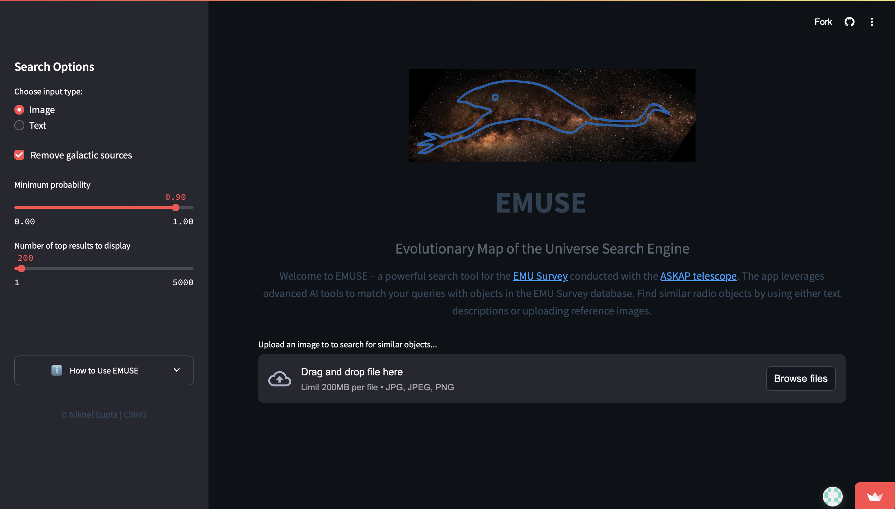

# EMUSE: Evolutionary Map of the Universe Search Engine

Welcome to **EMUSE** (Evolutionary Map of the Universe Search Engine), a powerful tool designed for exploring and identifying astronomical objects within the [EMU Survey](https://emu-survey.org/) conducted with the [ASKAP radio telescope](https://www.csiro.au/en/about/facilities-collections/ATNF/ASKAP-radio-telescope). Leveraging a fine-tuned CLIP multimodal model and a feature-rich database from the ASKAP EMU survey, ESOSE enables fast and accurate search for radio sources using either text descriptions or reference images.

## Features

EMUSE provides two main search methods:
- **Text Search**: Enter descriptive text to find similar objects.
- **Image Search**: Upload an image to find visually similar sources.

You can also customize search parameters such as filtering out galactic sources, setting a minimum confidence threshold, and choosing the number of top results to display.



## Demo

The app is deployed and available to try out [here](https://askap-emuse.streamlit.app/).

## Getting Started

To run the app locally, follow these steps:

### Prerequisites

Ensure you have Python installed on your system. The dependencies are listed in `requirements.txt`.

### Installation

1. Clone this repository:

   ```bash
   git clone https://github.com/your-username/EMUSE.git
   cd ESOSE
   ```

2. Install dependencies:

   ```bash
   pip install -r requirements.txt
   ```

### Running the App

Run the Streamlit app with the following command:

```bash
streamlit run main.py
```

## Using the App

EMUSE offers flexible search methods and parameters to help you find the most relevant astronomical objects in the EMU survey.

### Search Methods

#### Text Search
1. Select **'Text'** from the sidebar options.
2. Enter a description of the astronomical object you’re looking for (e.g., "A bent tailed radio galaxy").
3. Click **'Search'** to find matching objects from the EMU Survey.

#### Image Search
1. Select **'Image'** from the sidebar options.
2. Upload a reference image in `.jpg`, `.jpeg`, or `.png` format. The image can be a screenshot of your favorite radio source in the EMU survey or any other similar survey.
3. Click **'Search'** to find visually similar objects.

### Search Parameters

- **Remove Galactic Sources**  
  - When checked, filters out objects within 10 degrees of the galactic plane, focusing the search on extragalactic sources.  
  - Recommended for most searches.

- **Minimum Probability**  
  - Sets the confidence threshold for matches (0.0 to 1.0).
  - Higher values (e.g., 0.9) yield more precise but fewer results, while lower values include more results but may be less accurate.

- **Number of Top Results**  
  - Controls how many matching objects to display.
  - Range: 1 to 5000 results, defaulting to 200 results.
  - Adjust based on your search specificity and needs.

## About

This app uses advanced AI tools and a fine-tuned CLIP model to match user queries with features derived from the ASKAP EMU Survey database. It is designed to support astronomers and researchers in discovering and exploring unique radio objects in the sky.

Happy exploring!
